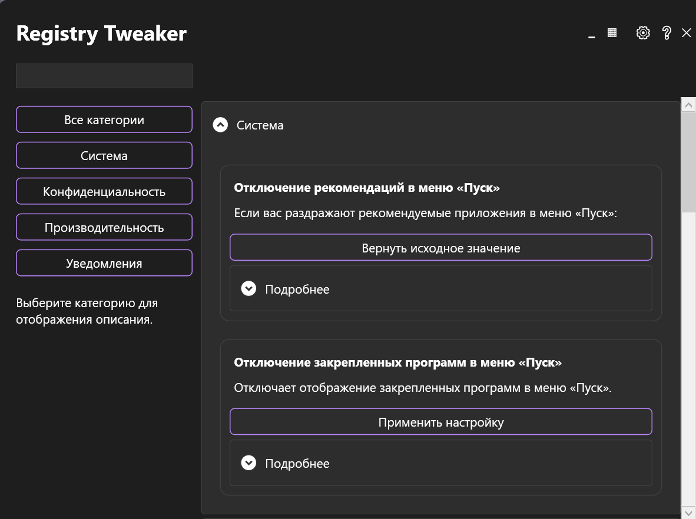

# Registry Tweaker

**Registry Tweaker** — это приложение для настройки и оптимизации Windows через редактирование реестра. Оно позволяет легко применять популярные твики для улучшения производительности, конфиденциальности и пользовательского опыта.

## Возможности

- **Удобный интерфейс**: Приложение предоставляет простой и интуитивно понятный интерфейс для применения твиков.
- **Категории твиков**: Твики разделены по категориям, что упрощает поиск нужных настроек.
- **Описание твиков**: Каждый твик сопровождается подробным описанием, чтобы вы понимали, что он делает.
- **Безопасность**: Все изменения реестра можно отменить, вернувшись к исходным значениям.

## Твики

В файле `tweaks.xml` содержатся следующие твики:

### Система
- **Отключение рекомендаций в меню «Пуск»**  
  Если вас раздражают рекомендуемые приложения в меню «Пуск», этот твик отключит их.
  - **Путь реестра**: `HKEY_CURRENT_USER\Software\Microsoft\Windows\CurrentVersion\Explorer\Advanced`
  - **Имя параметра**: `Start_NotifyIconHide`
  - **Значение**: `1`

- **Отключение закрепленных программ в меню «Пуск»**  
  Отключает отображение закрепленных программ в меню «Пуск».
  - **Путь реестра**: `HKEY_LOCAL_MACHINE\Software\Microsoft\Windows\CurrentVersion\Explorer\Advanced`
  - **Имя параметра**: `Start_TrackProgs`
  - **Значение**: `0`

### Конфиденциальность
- **Отключение телеметрии**  
  Отключает сбор данных телеметрии в Windows.
  - **Путь реестра**: `HKEY_LOCAL_MACHINE\Software\Policies\Microsoft\Windows\DataCollection`
  - **Имя параметра**: `AllowTelemetry`
  - **Значение**: `0`

- **Отключение Cortana**  
  Отключает Cortana в Windows.
  - **Путь реестра**: `HKEY_LOCAL_MACHINE\Software\Policies\Microsoft\Windows\Windows Search`
  - **Имя параметра**: `AllowCortana`
  - **Значение**: `0`

### Производительность
- **Отключение игрового режима**  
  Отключает игровой режим в Windows.
  - **Путь реестра**: `HKEY_CURRENT_USER\Software\Microsoft\GameBar`
  - **Имя параметра**: `AllowAutoGameMode`
  - **Значение**: `0`

- **Отключение индексации поиска**  
  Отключает индексацию файлов для поиска.
  - **Путь реестра**: `HKEY_LOCAL_MACHINE\Software\Microsoft\Windows Search`
  - **Имя параметра**: `SetupCompletedSuccessfully`
  - **Значение**: `0`

### Уведомления
- **Отключение уведомлений**  
  Отключает все уведомления в Windows.
  - **Путь реестра**: `HKEY_CURRENT_USER\Software\Microsoft\Windows\CurrentVersion\PushNotifications`
  - **Имя параметра**: `ToastEnabled`
  - **Значение**: `0`

- **Отключение звуков уведомлений**  
  Отключает звуки уведомлений в Windows.
  - **Путь реестра**: `HKEY_CURRENT_USER\Software\Microsoft\Windows\CurrentVersion\Notifications\Settings`
  - **Имя параметра**: `PlaySound`
  - **Значение**: `0`

## Как использовать

1. Запустите приложение **Registry Tweaker**.
2. Выберите категорию твиков, которую хотите применить.
3. Нажмите на кнопку "Применить" рядом с нужным твиком.
4. Перезагрузите компьютер, чтобы изменения вступили в силу.

## Восстановление исходных значений

Если вы хотите отменить изменения, вы можете восстановить исходные значения параметров реестра, нажав на кнопку "Отменить" рядом с примененным твиком.

## Лицензия

Этот проект распространяется под лицензией MIT. Подробности см. в файле [LICENSE](LICENSE).

---

**Примечание**: Будьте осторожны при редактировании реестра. Неправильные изменения могут привести к нестабильной работе системы. Рекомендуется создать точку восстановления системы перед применением твиков.
